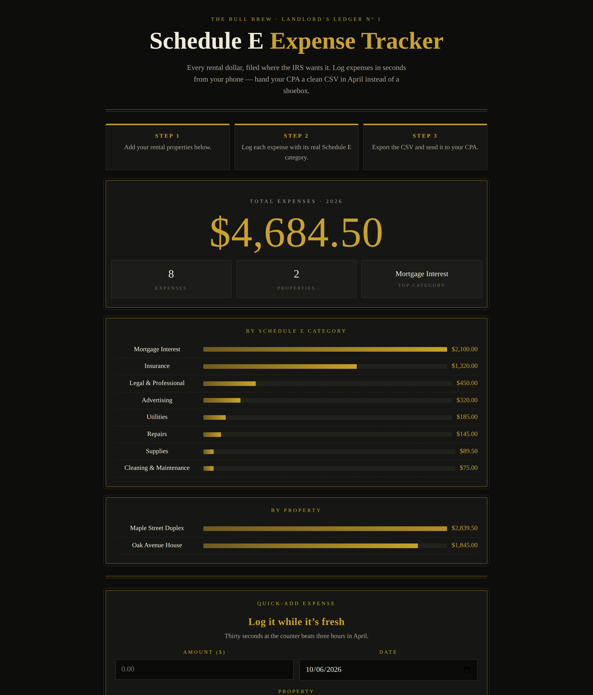

# Schedule E Expense Tracker

**Live:** https://thebullbrew.github.io/schedule-e-tracker/

A landlord's expense logger built around the real IRS Schedule E categories. Log every rental expense in seconds from your phone, watch running totals pile up per category and per property, and export a clean CPA-ready CSV at tax time — no shoebox, no spreadsheet archaeology.

## What it does

- **Quick-add expenses** — amount, date, property, Schedule E category (all 15 real ones: Advertising through Depreciation), vendor, notes, and an optional receipt photo stored locally.
- **Dashboard** — year-to-date total in big brass numerals, per-category bars, per-property totals.
- **Filters** — slice the ledger by property, category, and date range. Filters apply to the CSV export too.
- **CPA-ready CSV export** — date, property, category, vendor, amount, notes. Plus JSON backup/restore.
- **Multi-property** — add, track, and remove properties; edit or delete any entry.
- **100% local** — everything lives in your browser's localStorage. No account, no cloud, works offline as a PWA.

## The method behind it

April doesn't have to hurt. The landlords who pay the least in tax-prep fees are the ones whose books are already categorized when the year ends. This app makes the right behavior the easy behavior: thirty seconds at the counter, filed under the exact category your CPA's software expects.

## How to run

No build step. Open `docs/index.html` in any browser, or serve the `docs/` folder statically. Installable as a PWA (manifest + service worker included).

Built with HTML, CSS, and JavaScript. Part of [The Bull Brew](https://github.com/thebullbrew) daily finance & real-estate tool series.

*Not tax advice. Your CPA wears the green eyeshade — this just keeps it tidy.*
